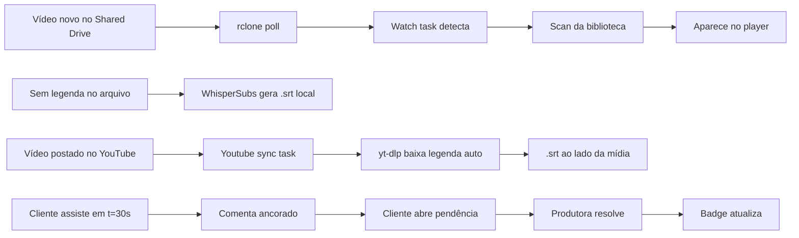

# ARQUITETURA — Goiás Tec +

## Visão geral

```
                    ┌─────────────────────────────────────────────────────────┐
                    │  Docker Compose (Windows / WSL2)                        │
                    │                                                         │
  Shared Drive ───► │  rclone (container) ──mount──►  volume "media"          │
  (Google)          │     │   --vfs-cache-mode full                           │
                    │     ▼                                                  │
                    │  jellyfin (container)                                   │
                    │   ├─ Jellyfin Server + plugin GoiasTecPlus (C#/.NET 9) │
                    │   ├─ WhisperSubs (legendas locais, whisper.cpp)         │
                    │   └─ yt-dlp + deno (legendas do YouTube)                │
                    │     │                                                   │
                    │     ▼                                                   │
                    │  Cliente: fork jellyfin-vue (web + futuro mobile)       │
                    └─────────────────────────────────────────────────────────┘
```

- **Fonte única de verdade**: Shared Drive. Quem tem acesso ao Drive posta; tudo que surgir
  aparece automaticamente (rclone poll + tarefa de watch do plugin → scan da biblioteca).
- **Cache local**: `--vfs-cache-mode full` torna replays e transcrição rápidos (1ª vez baixa do Drive).

## Componentes

| Componente | Tecnologia | Responsabilidade |
|---|---|---|
| `plugin/` (GoiasTecPlus) | C# / .NET 9, SQLite | Comentários, categorias, papéis, notificações, sync Drive/YouTube, API REST |
| `client/` | Vue 3 (fork jellyfin-vue) | UI: player com comentários, página do item, notificações, marca |
| `docker/` | Docker | Imagem Jellyfin + yt-dlp + deno + libs Whisper |
| `rclone/` | rclone | Mount do Shared Drive |
| WhisperSubs | plugin 3rd-party | Geração local de legendas (SRT) |

## Modelo de dados (SQLite — `{data}/goiastec/goiastec.db`)

- **categories** — `Id, Name, Color, SortOrder, IsDeletable`
- **comments** — `Id, ItemId, UserId, TimestampTicks, CategoryId, Body, ParentCommentId,
  Status(open/in_review/resolved), IsPrivate, IsPinned, CreatedAtUtc, EditedAtUtc, DeletedAtUtc`
- **comment_likes** — `(CommentId, UserId)`
- **user_roles** — `UserId → Role(superadmin/admin/editor/guest)`
- **youtube_mapping** — `ItemId, VideoId, Status(not_linked/linked/caption_downloaded/not_found/error),
  ChannelTitle, MatchedByName, LastCheckedUtc`
- **notifications** — `UserId, Type(reply/mention), CommentId, ItemId, ReadAtUtc`

> Posições no vídeo são **ticks do Jellyfin** (10.000.000 ticks = 1 segundo).

## Papéis e permissões

| Papel | Assiste | Comenta | Vê privados | Fluxo de revisão (status) | Modera/edita comentários | Gerencia categorias | Atribui papéis | Admin Jellyfin |
|---|---|---|---|---|---|---|---|---|
| superadmin | ✅ | ✅ | ✅ | ✅ | ✅ | ✅ | ✅ | ✅ |
| admin | ✅ | ✅ | ✅ | ✅ | ✅ | ✅ | ❌ | ✅ |
| editor (produtora) | ✅ | ✅ | ✅ | ✅ | ❌ | ❌ | ❌ | — |
| convidado (cliente) | ✅ | ✅ (público) | ❌ | ❌ (só abre) | ❌ | ❌ | ❌ | — |

**Fluxo de revisão**: o comentário nasce `open` (cliente aponta). A produtora (editor+) avança para
`in_review` e depois `resolved`. O badge "pendentes" conta os não resolvidos.

## Referência da API (`/GoiasTec` — todas exigem autenticação)

### Comentários — `/GoiasTec/Comments`
| Método | Rota | Descrição |
|---|---|---|
| GET | `/Comments?itemId=&categoryId=&includeResolved=&sortBy=time\|likes\|recent&onlyMine=` | Lista comentários |
| POST | `/Comments` | Cria (corpo: `ItemId, TimestampTicks, CategoryId, Body, ParentCommentId, IsPrivate`) |
| PUT | `/Comments/{id}` | Edita (autor ou admin+) |
| DELETE | `/Comments/{id}` | Exclui (autor ou admin+) |
| POST | `/Comments/{id}/Status` | Altera status (produtora/editor+) |
| POST | `/Comments/{id}/Pin?pinned=` | Fixa/desfixa (admin+) |
| POST/DELETE | `/Comments/{id}/Like` | Curtir / descurtir |
| GET | `/Comments/Items/{itemId}/PendingCount` | Badge de pendências |

### Categorias — `/GoiasTec/Categories`
| Método | Rota | Descrição |
|---|---|---|
| GET | `/Categories` | Lista |
| POST | `/Categories` | Cria (admin+) |
| PUT | `/Categories/{id}` | Edita (admin+) |
| DELETE | `/Categories/{id}` | Exclui (admin+; protegidas se `IsDeletable=false`) |

### Papéis — `/GoiasTec/Roles`
| Método | Rota | Descrição |
|---|---|---|
| GET | `/Roles/Me` | Papel do usuário atual (o cliente usa p/ liberar recursos) |
| GET | `/Roles` | Lista usuários + papéis (superadmin) |
| PUT | `/Roles/{userId}` | Atribui papel (superadmin) |

### Notificações — `/GoiasTec/Notifications`
| Método | Rota | Descrição |
|---|---|---|
| GET | `/Notifications?unreadOnly=&limit=` | Lista (do usuário atual) |
| GET | `/Notifications/UnreadCount` | Badge do sino |
| POST | `/Notifications/Read?id=` | Marca lida (id) ou todas (sem id) |

### YouTube — `/GoiasTec/Youtube`
| Método | Rota | Descrição |
|---|---|---|
| GET | `/Youtube/Channel` | Handle configurado |
| GET | `/Youtube/Status?itemId=` | Status do vínculo item↔vídeo |
| POST | `/Youtube/Link` | Vínculo manual (admin+) |
| POST | `/Youtube/Unlink?itemId=` | Remove vínculo (admin+) |
| POST | `/Youtube/SyncItem?itemId=` | Sync de 1 item (match + legenda) |
| POST | `/Youtube/SyncAll` | Sync em lote em background (admin+) |

## Tarefas agendadas (Dashboard > Tarefas)

1. **Goiás Tec +: detectar novos vídeos no Drive** — varre a pasta do mount, compara com um
   snapshot e dispara o scan da biblioteca quando há novos/alterados/removidos.
2. **Goiás Tec +: sincronizar legendas com o YouTube** — para cada vídeo: casa por nome de arquivo
   (ou usa o vínculo manual), baixa a legenda automática (`yt-dlp --write-auto-subs --sub-langs pt`)
   e salva como `<arquivo>.pt.srt` ao lado da mídia.

## Fluxos principais



## Decisões técnicas

- **Base do cliente = jellyfin-vue**: mesma base para web + mobile (PWA/Capacitor) no futuro.
- **Comentários no player e na página do item**; atalho `C` configurável.
- **Legendas**: Whisper local quando não há legenda; YouTube (yt-dlp/deno) quando o vídeo está postado.
- **Drive = rclone mount** (sem copiar), com cache local; quem tem acesso ao Drive publica.
- **YouTube**: match por nome de arquivo + fallback manual no admin; canal configurável (vazio até a conta existir).
- **Licença**: o plugin é GPLv3 (exigência do ecossistema Jellyfin).

## Fora de escopo (v1)

- Empacotamento do app mobile (lojas) — a base jellyfin-vue já garante o caminho.
- Upload de vídeo pela UI (entra pelo Drive).
- Sync de comentários com YouTube; e-mail de notificação; LDAP/SSO.
